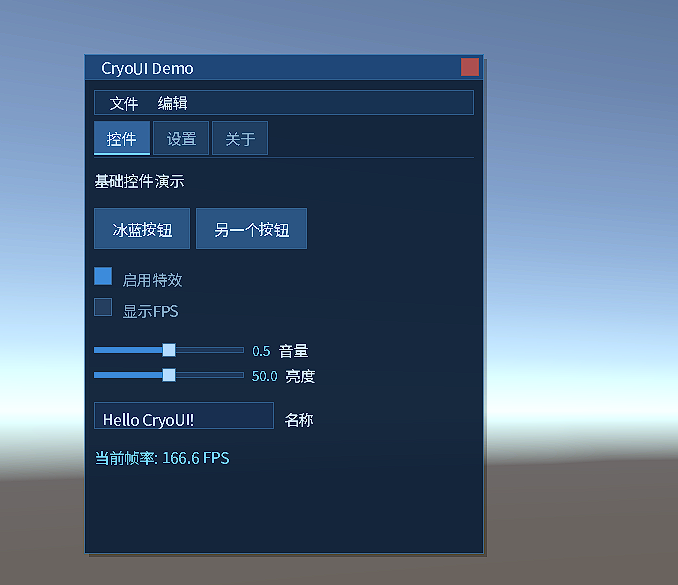

# CryoUI ❄️

[](https://unity.com/)
[](LICENSE)

CryoUI: A **Dear ImGui**-style immediate mode UI library re-imagined for **Unity 6** and modern Render Pipelines.



## 📦 安装

### 方式一：Git URL（推荐）

1. 打开 **Window → Package Manager**
2. 点击 **+** → **Add package from git URL...**
3. 输入：```https://github.com/tsingten/CryoUI.git```

### 方式二：手动编辑 manifest.json

在 `Packages/manifest.json` 中添加：
```json
{ "dependencies": { "com.tsingten.cryoui": "https://github.com/tsingten/CryoUI.git" } }
```  

### 指定版本
```https://github.com/tsingten/CryoUI.git#v1.0.0```  

## ⚙️ 配置

### 自动配置（推荐）
安装后，点击菜单 **Tools → CryoUI → Setup Renderer Feature** 一键完成配置。

### 手动配置
1. 打开你的 **URP Renderer Data** 资产
2. 点击 **Add Renderer Feature**
3. 选择 **CryoRendererFeature**

## 🎛️ 控件一览

| 控件 | 方法 |
|------|------|
| 窗口 | `BeginWindow` / `EndWindow` |
| 按钮 | `Button` |
| 文本 | `Label` / `Text` |
| 复选框 | `Checkbox` / `Toggle` |
| 滑块 | `Slider` / `SliderInt` |
| 输入框 | `InputText` / `InputInt` / `InputFloat` |
| 下拉菜单 | `Dropdown` |
| 树形视图 | `TreeNode` / `TreeLeaf` / `TreePop` |
| 折叠标题 | `CollapsingHeader` |
| 标签页 | `BeginTabBar` / `TabItem` / `EndTabBar` |
| 菜单栏 | `BeginMenuBar` / `BeginMenu` / `MenuItem` / `EndMenu` / `EndMenuBar` |
| 布局 | `SameLine` / `Spacing` / `Separator` |

## 📋 系统要求

- Unity 6000.0 或更高版本
- 支持 URP / HDRP / Built-in 渲染管线

## 📄 许可证

[MIT License](LICENSE) © Tsingten Yue